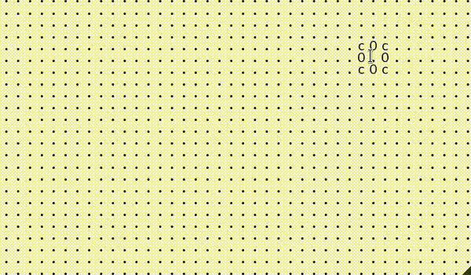
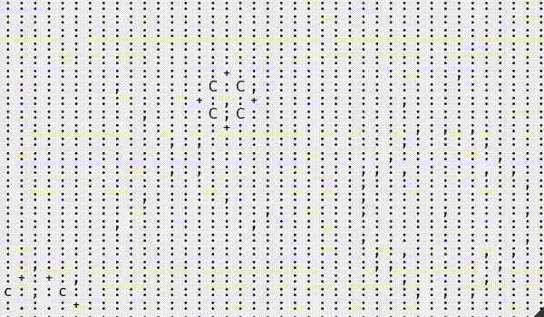

# Puddle.js

An ASCII/Node based fluid simulation library built with vanilla JS and CSS Grids.
Visit the site to play around and test! [Puddle.js](https://batman-nair.github.io/puddle.js/)

## Screencaps

Different Node styles!


Random Ripples mode!



## How to use it?

Add puddle.js to your webpage. You can initialize any div container to hold the puddle element.

```js
let puddle = new Puddle(<div-selector>);
puddle.setupGrid(); // To initialize the puddle
```

There are a lot of options which can be used to tweak your puddle element.

```js
puddle.setNodeStyle(nodeStyle);  // nodeStyle one of ["base", "ascii", "water", "party"]  // Default "base"
puddle.setMathMode(mathMode);  // mathMode one of ["anair", "helias"]   // Default "anair"
puddle.setNodeSize(nodeSize);  // Default 3% of min(height, width) of container
puddle.setUpdateInterval(updateInterval);  // Default 100ms

puddle.toggleRandomRipples();	// Default False
puddle.toggleRandomRippleStrength(); // Default True
puddle.setMaxRippleStrength(rippleStrength);  // Default 100
puddle.setRandomRippleGenerationInterval(generationInterval);  // Default updateInterval  min: updateInterval
puddle.setRandomRippleTimeRange(timeRange);  // Default updateInterval  max: updateInterval
// Random ripples are generated at RippleGenerationInterval (+/-) RippleTimeRange/2

puddle.createRandomRipple();
puddle.createWave();

puddle.setDampeningRatio(dampeningRatio); // Default 0.8  between 0 and 1

puddle.toggleRippleOnMove(); // Default True

```

## Internal workings

The different node styles are different classes NodeBase, AsciiNode, WaterNode, PartyNode.

There are 2 different math modes - how forces are updated every frame.

 1. Anair - The initial mode developed. Every node has X and Y forces. The whole force is is transfered to the nodes in the direction of the force.
 2. Helias - This was taken from [here](https://web.archive.org/web/20160418004149/http://freespace.virgin.net/hugo.elias/graphics/x_water.htm). The force updates in this mode are more based on actual wave motion.

Every node to be updated is added to an updateQueue. When a click is registered, all the surrounding nodes are added to the updateQueue. In the update loop, the next force value for the node is calculated based on existing forces in the surrounding nodes. Once update is done, the node is added to a drawQueue.

At every frame, there is an update section where net forces for nodes in the updateQueue are calculated. After that, in the draw section, the current force is updated and the node is drawn.

When a node is updated, it adds other nodes which will be affected by its force to the next updateQueue. This way only the affected nodes needs to be updated instead of updating te whole frame in every loop.
